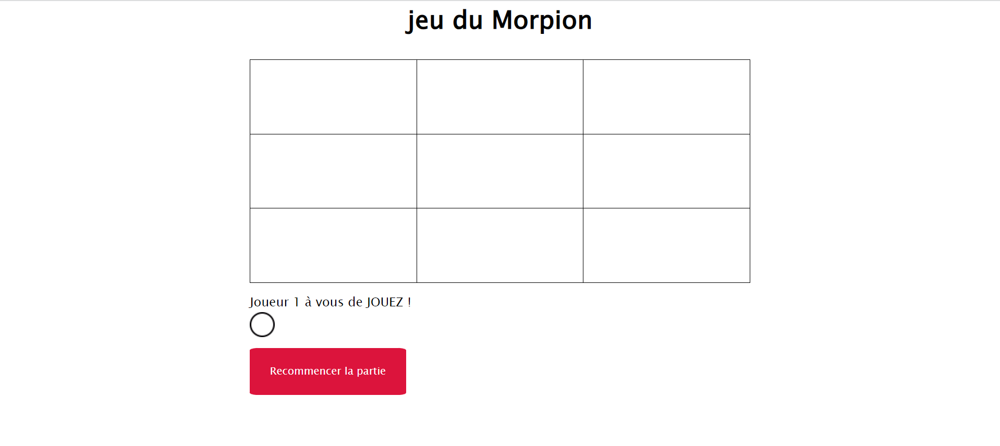

# Tic-Tac-Toe (Morpion) Game

## Overview

This is a simple Tic-Tac-Toe (Morpion) game implemented in pure JavaScript. The game allows two players to take turns and compete to achieve a winning combination on the game board. It's a classic game that provides a great way to pass the time and test your strategic skills.

## Play the Game Online

You can play the game online by clicking the following link: Tic-Tac-Toe Game

## Features 

- Two-player gameplay: Play against a friend or family member.
- Interactive game board: Click on the cells to make your move.
- Win detection: The game automatically detects a win, draw, or ongoing play.
- Reset button: Start a new game anytime with the reset button.
- Fun and challenging: Test your strategic thinking in this timeless game.

## How to Play

1. Open the game in your web browser using the provided link.
2. Two players take turns clicking on an empty cell to place their symbol (X or O).
3. The first player to get three of their symbols in a row (horizontally, vertically, or diagonally) wins the game.
4. If all cells are filled and no player has won, the game is declared a draw.
5. Use the "Restart" button to start a new game at any time.

## Technologies Used

- HTML: Used to structure the game board and user interface.
- CSS: Styled the game for an appealing appearance.
- TypeScript: Implemented the game's logic and interactivity.

## Installation

To play the game locally, you can clone this repository and open the index.html file in your web browser. No additional installation is required.

## Contributing 

Contributions are welcome! If you have any suggestions, bug reports, or feature requests, please open an issue on the GitHub repository.